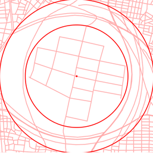
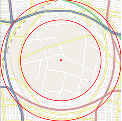
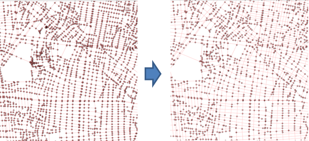

# description

OSM版glueサーバ
詳細
<http://rain.elcom.nitech.ac.jp/tsg-wiki/index.php?GlueServerOsm>

* <http://133.68.13.112:8080/EmmaGlueMuraseOriginal/MainServlet?type=ConvertElasticPoints&centerLngLat=136.9288336363183,35.158167325045824&points=136.92588320639172,35.15937778672364,136.9266127672479,35.15893921573326,136.9270526495242,35.15869361494546,136.92767492201676,35.15823749722958,136.92857614424028,35.15764103174276,136.92920914557283,35.15704456188256,136.92994943525997,35.15660597831222,136.93057170775256,35.15601827262135,136.93055025008164,35.156000729102885&focus_zoom_level=17&context_zoom_level=15&glue_inner_radius=200&glue_outer_radius=300>
	- 緯度経度からglue上のxy座標に変換

* <http://133.68.13.112:8080/EmmaGlueMuraseOriginal/MainServlet?type=DrawGlue_v2&centerLngLat=136.9369411468506,35.15805494125627&focus_zoom_level=16&context_zoom_level=15&glue_inner_radius=125&glue_outer_radius=200&roadType=car>
	- 提案システムのglue

* <http://133.68.13.112:8080/EmmaGlueMuraseOriginal/MainServlet?type=DrawMitinariSenbetuAlgorithm&centerLngLat=136.9365119934082,35.158405798185974&focus_zoom_level=16&context_zoom_level=15&glue_inner_radius=125&glue_outer_radius=200&roadType=car>
	- 小関さんの道なり道路選別手法を使ったglue

* <http://133.68.13.112:8080/EmmaGlueMuraseOriginal/MainServlet?type=DrawElasticStroke_v2&centerLngLat=136.9309671669116,35.15478942665804&focus_zoom_level=17&context_zoom_level=15&glue_inner_radius=200&glue_outer_radius=300>
	- glueをstrokeにしてみた
	- 
* <http://133.68.13.112:8080/EmmaGlueMuraseOriginal/MainServlet?type=DrawElasticRoad&centerLngLat=136.9309,35.1547&focus_zoom_level=17&context_zoom_level=15&glue_inner_radius=200&glue_outer_radius=300&roadType=car>
	- focus,glue,contexっぽい地図を作製した
	- 
* <http://133.68.13.112:8080/EmmaGlueMuraseOriginal/MainServlet?type=DrawSimplifiedStroke&centerLngLat=136.9309671669116,35.15478942665804&scale=15&threshold=50>
	- l2errorNormを使ってline simplification(現在は上位50本のストロークをsimplifyして描画)
	- 
* <http://133.68.13.112:8080/EmmaGlueMuraseOriginal/MainServlet?type=DrawSimpleRoad>
	- DBから道路データを取得し，描画後，画像データとしてクライアントに返す

* <http://133.68.13.112:8080/EmmaGlueMuraseOriginal/MainServlet?type=Test>
	- サーブレットで描画した図形を画像データとしてクライアントに返す

# バージョン履歴
##
書くのめんどくさくなったのでコミットメッセージ見てください
## v2_1_3
DrawSimplifiedStroke：line simplification機能の追加
## v2_1_2
DrawElasticRoad：道路に色を付けた

## v2_1_1
ストロークに対応

## v2_1_0
URLのパラメータの設定可能

<http://133.68.13.112:8080/EmmaGlueMuraseOriginal/MainServlet?type=DrawElasticRoad&centerLngLat=136.9309,35.1547&focus_zoom_level=17&context_zoom_level=15&glue_inner_radius=200&glue_outer_radius=300&roadType=car>

## v2_0_3
細かい修正

## v2_0_0

* 緯度経度，投影法の変換をPostGISでなくjavaで処理することで高速化した(LngLatMercatorUtility).

DrawElasticRoad

* オリジナルのglueサーバと同じように道路変形をする

## v1_0_0

DrawElasticRoad

* contextからfocusにつながるようにスケールを多段にする(すべての道路)

DrawElasticStroke

* contextからfocusにつながるようにスケールを多段にする(ストロークを使う)

DrawSimpleRoad

* 単純な道路の描画

Test

* 描画のテスト

同心円，放射方向に対してスケール変化する

